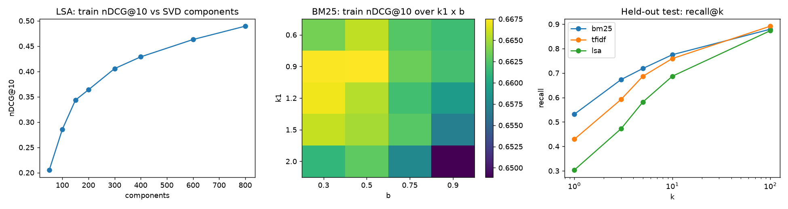

# AI Research Copilot


Upload documents (PDF or text), ask a question, and get the most relevant passages back,
each with a citation to its source document. Retrieval runs on the server with no external
API calls. Optionally, if you set your own OpenAI key locally, it also writes a cited
answer from those passages.

The retriever was chosen and tuned on a **real, human-labelled benchmark**: BEIR SciFact,
which has 5,183 scientific abstracts and 1,109 expert-written claims.

**Live demo:** https://ai-research-copilot-3jwt.vercel.app ("Load example", then ask)
**API docs:** https://ai-research-copilot-delta.vercel.app/docs

## Results on SciFact (300 held-out test claims)

| Metric | BM25 (shipped) | TF-IDF | LSA (800 dims) | Previous version: LSA (150 dims) |
|---|---|---|---|---|
| **nDCG@10** | **0.6631** | 0.5974 | 0.4904 | 0.3477 |
| Top result relevant (precision@1) | **55.00%** | 44.33% | 32.33% | 20.00% |
| Recall@1 | **53.17%** | 42.94% | 30.36% | 18.50% |
| Recall@5 | **71.86%** | 68.68% | 58.14% | 40.30% |
| Recall@10 | **77.49%** | 75.93% | 68.70% | 52.10% |
| Recall@100 | 87.92% | **89.16%** | 87.32% | 79.30% |
| Precision@5 | **15.53%** | 14.80% | 12.80% | 9.13% |
| MRR@10 | **0.6328** | 0.5512 | 0.4366 | 0.2997 |
| MAP@100 | **0.6281** | 0.5479 | 0.4321 | 0.3009 |
| p95 search time over 5,183 abstracts | 4.2 ms | 4.6 ms | 122.7 ms | 20.9 ms |
| Index build time | 1.57 s | 1.19 s | 31.72 s | n/a |

Most SciFact claims have exactly one relevant abstract (1.13 per claim in the test split),
so precision@5 can be at most about 23% and the precision@k numbers are naturally low;
recall@k and nDCG@10 are the meaningful ones.

The BM25 implementation here scores 0.6631 nDCG@10. The BEIR paper reports 0.665 for its
Elasticsearch BM25 baseline on the same split, which is a good sanity check that both the
retriever and the metrics are implemented correctly.

**Moving from the previous LSA setup to tuned BM25 nearly doubled nDCG@10 (0.348 → 0.663)**,
and the top result is now relevant for 55% of claims instead of 20%.

On all 1,109 labelled claims (train and test together), BM25 scores nDCG@10 0.6663,
recall@5 72.06% and MRR@10 0.6357, consistent with the held-out numbers.

### What this means for a user

| Question a user cares about | Answer (held-out test) |
|---|---|
| How often is a relevant abstract on the first screen (top 5)? | 74.0% of claims |
| How far down is the first relevant result, typically? | position 1 (median) |
| How many claims have no relevant abstract in the top 100? | 34 of 300 |
| How long does a search take over 5,183 abstracts? | 3.5 ms median, 4.2 ms p95 (laptop CPU) |
| What does a search cost in API fees? | $0. Retrieval makes no external calls |

## How the benchmark works

`backend/src/copilot/eval_scifact.py`:

1. Every abstract goes through the **same chunker the API uses** (220-word windows, 40
   words of overlap), giving 8,620 chunks. A document's score is its best chunk's score.
2. Each retriever's settings are tuned on the 809 **train** claims only, using a grid
   search on nDCG@10:
   - BM25: k1 ∈ {0.6, 0.9, 1.2, 1.5, 2.0} × b ∈ {0.3, 0.5, 0.75, 0.9}. Best: k1 = 0.9,
     b = 0.5 (train nDCG@10 0.6675).
   - TF-IDF: sublinear vs raw term frequency. Best: sublinear (0.6076).
   - LSA: 50 to 800 SVD components. Best: 800 (0.4894), still rising at the edge of the
     grid but already about 20× slower than BM25 to build.
3. The tuned retrievers are scored **once** on the 300 standard BEIR **test** claims.

Retrieval involves no gradient training, so there are no epochs or loss curves. The
tuning curves below play that role:



Full per-retriever numbers, both query sets, and every tuning point are in
`reports/scifact_metrics.json`. The API serves the headline numbers from
`backend/src/copilot/benchmark.json` at `GET /v1/benchmark`.

## Data

| Dataset | Contents | License |
|---|---|---|
| [BEIR SciFact](https://github.com/beir-cellar/beir) ([zip](https://public.ukp.informatik.tu-darmstadt.de/thakur/BEIR/datasets/scifact.zip), SHA-256 `536e1444…0165`) | 5,183 abstracts, 1,109 claims, 1,258 relevance judgements (919 train, 339 test) | claims CC BY 4.0; abstracts ODC-By 1.0 (S2ORC) |

`python scripts/download_scifact.py` downloads the archive, verifies the checksum and
extracts it to `data/scifact/`. The data is not committed.

## How the app works

1. **Ingest**: PDFs are converted to text with `pypdf`; plain text is used as-is.
2. **Chunk**: 220-word windows with 40 words of overlap, so passages stay readable.
3. **Retrieve**: BM25 (k1 = 0.9, b = 0.5) ranks every chunk; the top k come back with
   their document name, position and score.
4. **Generate (optional, local only)**: with `OPENAI_API_KEY` set, the top passages are
   sent to the OpenAI Responses API (model `gpt-4o-mini`, override with `OPENAI_MODEL`)
   with instructions to answer only from them and cite `[n]`. The public demo never calls
   a paid API. If the key is invalid, the request still returns the retrieved passages.

The API is stateless: each `/v1/query` builds the index from the documents in that
request, because a serverless deployment can't guarantee two requests reach the same
instance. Index build time is milliseconds for demo-sized inputs.

**Why not a neural embedding model?** It might retrieve better, but it pulls in `torch`
and a model of hundreds of MB, which doesn't fit a Vercel serverless function. Measured
on SciFact, tuned BM25 is the best of the three options that do fit.

## Run it locally

Backend:

```bash
cd backend
pip install -r requirements-dev.txt
PYTHONPATH=src python -m uvicorn copilot.api.app:app --reload --port 8000
```

Frontend:

```bash
cd frontend
npm install
echo "NEXT_PUBLIC_API_BASE_URL=http://localhost:8000" > .env.local
npm run dev
```

Reproduce the benchmark (about 11 minutes on a laptop CPU):

```bash
python scripts/download_scifact.py
cd backend && PYTHONPATH=src python -m copilot.eval_scifact --data-dir ../data/scifact --out ../reports/scifact_metrics.json
```

## Tests

```bash
cd backend && pytest --cov=src
```

36 tests (82% line coverage) cover chunking, all three retrievers, the ranking metrics
checked against hand-computed values (nDCG, MAP, MRR, recall, precision), BEIR file
loading, PDF/text ingestion and the API, including graceful fallback when an OpenAI key
is invalid. CI runs backend lint and tests on Python 3.11 to 3.13, plus frontend lint and
build.

## Limitations

- SciFact measures retrieval of scientific abstracts for claims. Results on other
  document types (contracts, code, chat logs) may differ.
- BM25 matches words, not meaning: a question that uses different wording from the
  document can miss it. 34 of 300 test claims had no relevant abstract in the top 100.
- Generated answers are not benchmarked. Only retrieval is measured here.

## References

- D. Wadden et al., "Fact or Fiction: Verifying Scientific Claims", EMNLP 2020.
- N. Thakur et al., "BEIR: A Heterogeneous Benchmark for Zero-shot Evaluation of
  Information Retrieval Models", NeurIPS 2021 Datasets and Benchmarks.
- S. Robertson and H. Zaragoza, "The Probabilistic Relevance Framework: BM25 and Beyond",
  2009.

## License

MIT for the code. SciFact keeps its own licenses (see Data).
